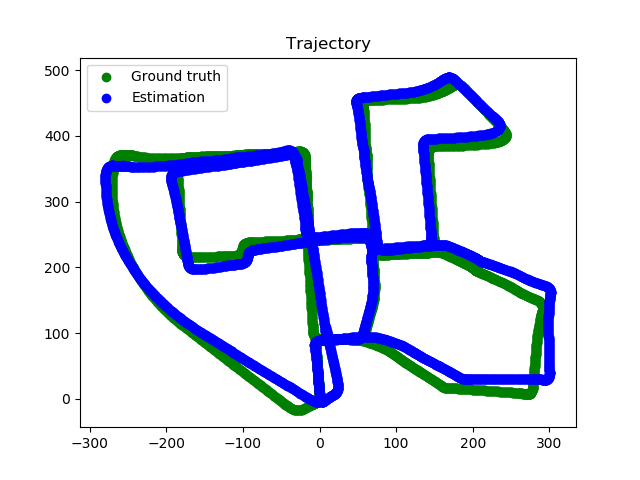
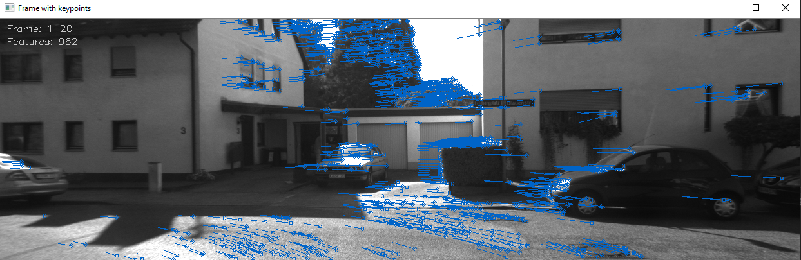
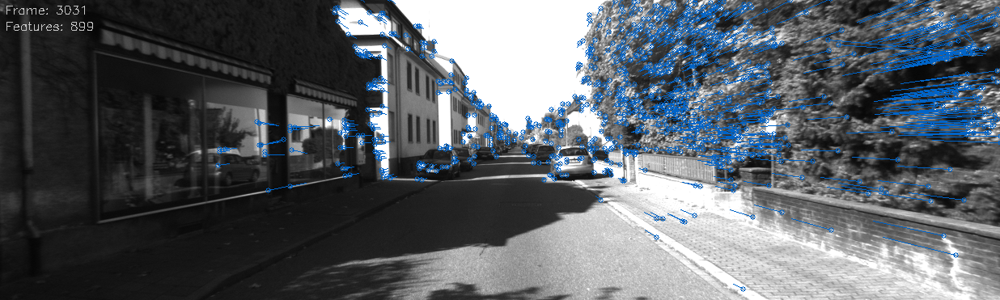

  

## Monocular Visual Odometry

**DatasetReaderKITTI** is responsible for loading frames from [KITTI Visual Odometry Dataset](http://www.cvlibs.net/datasets/kitti/eval_odometry.php) (optionally scaling them to reduce processing time) and ground truth (camera matrix, camera position and scale).

In a processing loop I convert images to greyscale, run keypoint detection using GFTT and then track these keypoints with **FeatureTracker** that uses OpenCV optical flow. After finding feature tracks, I remove outliers (outside of image). In the next step I estimate the essential matrix *E* to find relative pose *R*, *t* between consecutive frames. Calculating *E* matrix also allows to remove few outliers (found by RANSAC). Having that rotation and translation, I calculate absolute position and orientation of the camera and I use them to draw a trajectory.

To get better results, I rely on absolute scale provided as KITTI groundtruth when computing abs. pose.

There are plenty things to add: generating point cloud, measuring the accuracy of trajectory and so on.

  

  

